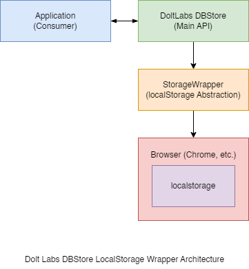

# DoltDBStore Developer Documentation

## Overview
DoltDBStore is a lightweight JavaScript library providing an offline-first key-value storage system. It implements a wrapper around the browser's localStorage API with CRUD operations and automatic serialization.

## Architecture



### Core Components

1. **DoltDBStore (Main Entry)**
- Entry point class for storage operations
- Located in `index.js`
- Manages single storage instance per schema

2. **StorageWrapper**
- Core storage handling implementation
- Provides direct localStorage interaction
- Manages data persistence and retrieval
- Located in `storageWrapper.js`

3. **Utilities**
- `keyGenerator.js`: Provides unique key generation
- `serializer.js`: Handles data serialization

## Technical Implementation

### Data Storage
- Utilizes browser's localStorage API
- Data stored as serialized strings
- Uses schema-based storage keys
- Supports any serializable data type

### Data Structure
- Data organized by unique keys
- No predefined schema requirements
- Supports primitive and complex types
- All data automatically serialized

### API Methods

#### Core Operations
- `set(key, value)`: Stores data with given key
- `get(key)`: Retrieves data by key
- `remove(key)`: Deletes data by key
- `clear()`: Removes all data
- `has(key)`: Checks key existence

#### Additional Features
- `generateKey()`: Creates unique storage key
- Automatic data serialization/deserialization
- Error handling for storage operations

## Error Handling
- Validates storage availability
- Handles serialization errors
- Reports storage quota issues

## Usage Examples
```javascript
const store = new DoltDBStore();

// Store data
store.set('user1', { name: 'John' });

// Retrieve data
const user = store.get('user1');

// Check existence
const exists = store.has('user1');

// Remove data
store.remove('user1');
```